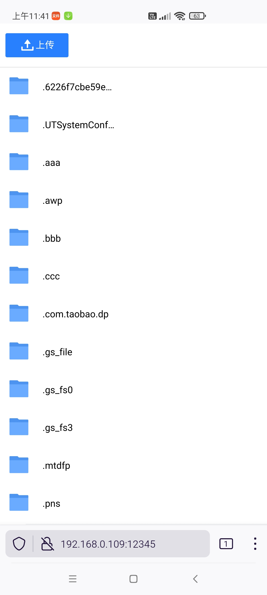

# Wifi文件服务器

无需USB线，轻松传输手机数据。

通过Wifi在手机、电脑、平板等智能设备上共享文件。

支持在用户授权下访问 `/storage/emulated/0/Android/data` 目录

使用方法：

* **没有WIFI也可以使用**，打开手机热点，其他设备连接即可
* 拖拽文件到页面即可上传文件到手机
* 文件上传后存放的目录：`/storage/emulated/0/Download`
* 服务器开启后，好友可播放手机上的视频、音乐或图片，高速又便携





## 限制

* 如开启 VPN 程序，通过局域网 IP 无法连接该程序

## 远程调试

```
adb tcpip 5000
adb connect 192.168.8.55:5000
git add . && git commit -m "更新" && git push
```

## 第三方

* https://github.com/NanoHttpd/nanohttpd