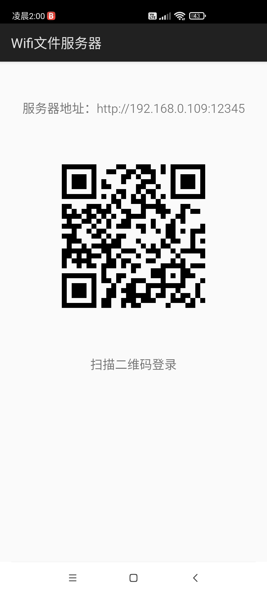
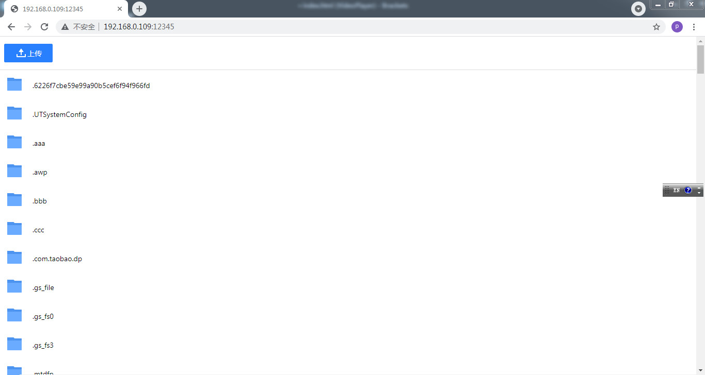

# Wifi文件服务器

无需USB线，轻松传输手机数据。

通过Wifi在手机、电脑、平板等智能设备上共享文件。

该程序大部分代码使用C/C++语言，低耗能高效率

使用方法：

* **没有WIFI也可以使用**，打开手机热点，其他设备连接即可。
* 拖拽文件到页面即可上传文件到手机

## 限制

* 安卓新版本无法访问其他程序的数据，无法访问 `/storage/emulated/0/Android/data`路径
* 如开启 VPN 程序，通过局域网 IP 无法连接该程序

## 第三方

* https://github.com/yhirose/cpp-httplib
* https://github.com/ricmoo/QRCode